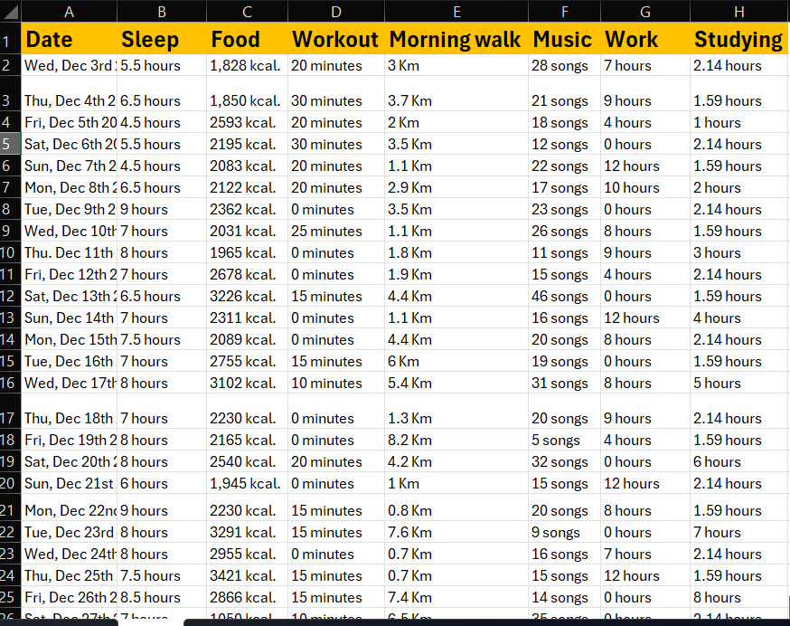
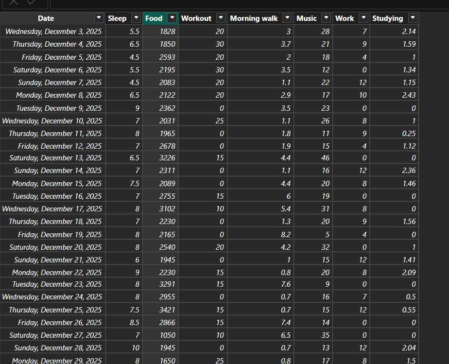
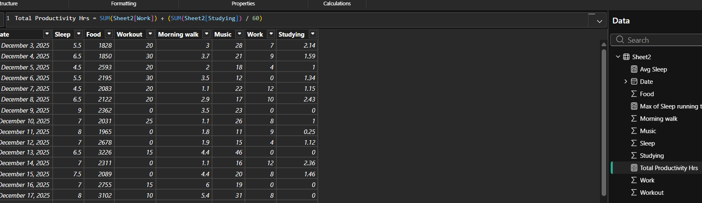

# Daily Routine Analysis Showcase
## Introduction
This is my own personal project using manually collected data by myself over a 2 months period mainly to showcase what I've learned so far using multiple tools and also to determine if my current life-style is actually allowing me to be productive, So win-win.
### Dashboard file
You can find the dashboard here: [Daily_Routine_Viz.pbix](Daily_Routine_Viz.pbix)
## Skills and tools showcased
- **Excel** for collecting and maintaining data, And also to layout the plan on how to correlate and put the data collected to use by making a hash for the dashboard layout.

- **Power Query** was used to process the ETA for the data collected to be able to manipulate it and use it properly within the dashboard for measuares and compares.

- **DAX Measures** by using the embeded DAX in the power-query/power-bi app, I was able to benefit from it to make measures to calculate various data types to make correlations and help me visualize it on my charts and dashboard.

## Dashboard Overview

My mission after showcasing the tools above and using it to manipulate the data towards my goal, Was to also gain an insight on my own personal activities and how do they affect me, Hence this Dashboard which allows me in a quick glance over a few key areas in my routine to determine what worked and what needs to be altered or enhanced.
## Conclusion
- This dashboard showcases how Power BI can transform raw manually collected data into key insights in a few cards and charts for me to be able to better my own set routine.
- The 4 tools used can work hand in hand towards making a total refined complete package for any task at hand as I have showcased.
